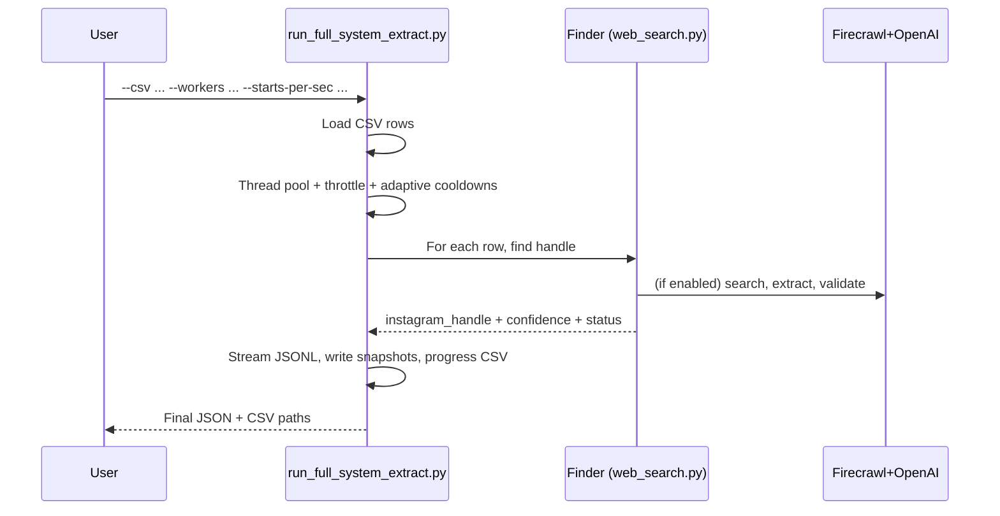

## RUN_FULL_SYSTEM_EXTRACT — Bulk Instagram Handle Discovery Guide

This guide explains how the extraction-only runner works to find Instagram handles for many restaurants in bulk, driven by the merchant (Mx) name and address from a CSV. It’s designed for both non-technical and technical readers.

---

### What this run does (non-technical)

- Finds each restaurant’s Instagram handle using web search and AI-assisted analysis.
- Verifies with lightweight heuristics to reduce false positives.
- Produces CSV/JSON outputs you can share directly with other teams.
- Shows live progress and periodically saves a “latest” snapshot so you don’t lose work.

Inputs: a CSV with basic columns (`BUSINESS_ID`, `STORE_ID`, `RESTAURANT NAME`, `ADDRESS`).
Outputs: result files in `results/` with handles, confidence, and status.

---

### Quick start

- Install dependencies and set API keys (see Setup).
- Run the extractor:
```bash
python run_full_system_extract.py --csv "data/MASTER-NASHVILLE-DETROIT.csv" --workers 6 --starts-per-sec 1.5 --shuffle --enable-ddg
```
- Watch progress in your terminal. Final outputs appear under `results/`.

---

### Visual overview

```mermaid
flowchart LR
  A[CSV rows: BUSINESS_ID, STORE_ID, RESTAURANT NAME, ADDRESS] --> B[Thread pool with starts/sec throttle]
  B --> C[RestaurantInstagramFinder: multi-strategy search]
  C --> D[Handle found? yes]
  C --> E[Handle not found? no]
  D --> F[Confidence scoring + status]
  E --> F
  F --> G[Stream JSONL + periodic snapshots (CSV/JSON)]
  G --> H[Final results saved (CSV + JSON)]
  H --> I[Review flags when a business has multiple handles]
```

---

### Who should use this

- Non-technical ops/BD: supply the CSV and run the command above; collect the `results/*.csv`.
- Technical users: tune rate limits, pick strategies (Google CSE, DDG, Firecrawl + OpenAI), and integrate downstream.

---

## How it works (technical)

### 1) Input schema and loader

- Expected columns (case-sensitive in code): `BUSINESS_ID`, `STORE_ID`, `RESTAURANT NAME`, `ADDRESS`.
- Extra columns are ignored.
- Internally normalized to `business_id`, `store_id`, `restaurant_name`, `address`.

Code reference:
```26:52:/Users/varunjain/media_manager/run_full_system_extract.py
def load_input_dataset(csv_path: Union[str, Path]) -> List[Dict]:
    """Load input dataset rows. Requires minimal columns used by the pipeline.

    Expected columns:
    - BUSINESS_ID
    - STORE_ID
    - RESTAURANT NAME
    - ADDRESS
    Extra columns are ignored.
    """
    path = Path(csv_path)
    if not path.exists():
        raise FileNotFoundError(f"Dataset not found: {path}")

    rows: List[Dict] = []
    with open(path, "r", encoding="utf-8") as f:
        reader = csv.DictReader(f)
        for row in reader:
            rows.append({
                "business_id": (row.get("BUSINESS_ID") or "").strip(),
                "store_id": (row.get("STORE_ID") or "").strip(),
                "restaurant_name": (row.get("RESTAURANT NAME") or "").strip(),
                "address": (row.get("ADDRESS") or "").strip(),
            })

    print(f"📦 Loaded {len(rows)} rows from {path}")
    return rows
```

Sample CSV:
```csv
BUSINESS_ID,STORE_ID,RESTAURANT NAME,ADDRESS
B123,S001,Crepevine,560 Valencia St, San Francisco, CA
B124,S002,Antonio's of Beacon Hill,41 Charles St, Boston, MA
```

---

### 2) Bulk orchestration, concurrency, and safety

- Concurrency: `ThreadPoolExecutor(max_workers=N)`.
- Start-throttling: `--starts-per-sec` enforces minimum spacing between job starts.
- Adaptive backoff: honors global cooldowns reported by upstream libraries to avoid 429s (OpenAI / Firecrawl).
- Streaming and snapshots: optional JSONL stream; periodic “latest” CSV/JSON snapshots; rolling progress CSV with ETA.

Code reference (signature and core loop):
```110:139:/Users/varunjain/media_manager/run_full_system_extract.py
def process_dataset_extract(
    restaurants: List[Dict],
    max_workers: int = 6,
    starts_per_sec: float = 1.5,
    shuffle: bool = True,
    enable_google: bool = True,
    enable_ddg: bool = True,
    save_every: int = 0,
    jsonl_path: str = "",
    latest_json_path: str = "",
    latest_csv_path: str = "",
    progress_csv_path: str = "",
    terse: bool = False,
    progress_every: int = 100,
) -> List[Dict]:
    """Run extraction-only flow with optional start-rate throttling and shuffling.
    If save_every > 0, results are streamed to JSONL and periodic snapshots are written.
    """
    print(f"🚀 Starting extraction for {len(restaurants)} rows with {max_workers} workers...")
    if shuffle:
        print("🔀 Shuffling input order")
        random.shuffle(restaurants)

    start_time = time.time()
    results: List[Dict] = []
    jsonl_file = None
    found_counter = 0
    error_counter = 0
```

Code reference (throttle + adaptive backoff + thread submit):
```158:186:/Users/varunjain/media_manager/run_full_system_extract.py
with ThreadPoolExecutor(max_workers=max_workers) as executor:
    future_to_restaurant = {}
    last_start_ts = 0.0
    min_interval = (1.0 / starts_per_sec) if starts_per_sec and starts_per_sec > 0 else 0.0
    total = len(restaurants)

    # Prepare JSONL stream file if requested
    if jsonl_path:
        try:
            jsonl_file = open(jsonl_path, "a", encoding="utf-8")
        except Exception as e:
            print(f"⚠️ Could not open JSONL stream file '{jsonl_path}': {e}")
            jsonl_file = None

    for i, restaurant in enumerate(restaurants):
        if min_interval > 0:
            now = time.time()
            elapsed = now - last_start_ts
            if elapsed < min_interval:
                time.sleep(min_interval - elapsed)
            last_start_ts = time.time()
        # Global adaptive cooldowns based on prior 429s
        try:
            openai_wait, firecrawl_wait = get_rate_cooldowns()
            adaptive_sleep = max(openai_wait, firecrawl_wait)
            if adaptive_sleep > 0:
                print(f"⏳ Backing off {adaptive_sleep:.1f}s due to upstream rate limits...")
                time.sleep(adaptive_sleep)
        except Exception:
            pass

        fut = executor.submit(process_single_restaurant_extract, restaurant, i + 1, total, enable_google, enable_ddg, terse)
        future_to_restaurant[fut] = restaurant
```

Code reference (periodic “latest” snapshots):
```140:157:/Users/varunjain/media_manager/run_full_system_extract.py
def _write_latest_snapshot():
    try:
        if not results:
            return
        if latest_json_path:
            with open(latest_json_path, "w", encoding="utf-8") as jf:
                json.dump(results, jf, indent=2, ensure_ascii=False)
        if latest_csv_path:
            fieldnames = list(results[0].keys())
            with open(latest_csv_path, "w", newline="", encoding="utf-8") as cf:
                writer = csv.DictWriter(cf, fieldnames=fieldnames)
                writer.writeheader()
                writer.writerows(results)
        if latest_json_path or latest_csv_path:
            print(f"💾 Snapshot saved: {latest_json_path or '[json disabled]'} | {latest_csv_path or '[csv disabled]'}")
    except Exception as snapshot_err:
        print(f"⚠️ Failed to write snapshot: {snapshot_err}")
```

- Global cooldown source:
```491:496:/Users/varunjain/media_manager/firecrawl_search.py
def get_rate_cooldowns() -> tuple[float, float]:
    """Return remaining cooldown seconds for (openai, firecrawl)."""
    now = time.time()
    openai_rem = max(0.0, _OPENAI_COOLDOWN_UNTIL - now)
    firecrawl_rem = max(0.0, _FIRECRAWL_COOLDOWN_UNTIL - now)
    return openai_rem, firecrawl_rem
```

---

### 3) Per-row extraction flow

For each row:
1) Build a `RestaurantInstagramFinder` with chosen strategies (Google CSE and/or DuckDuckGo).
2) Call `_process_single_row` which runs `find_instagram_handle(name, address, phone)` with multiple strategies:
   - Google Custom Search (if configured)
   - GPT-native web search
   - Firecrawl + OpenAI extraction with location weighting
   - Google My Business heuristics
   - DuckDuckGo HTML (no API key)
3) Return a minimal result: `instagram_handle`, `confidence_score`, `confidence_grade`, `discovery_method`, `status`, `message`.

Code reference:
```55:91:/Users/varunjain/media_manager/run_full_system_extract.py
def process_single_restaurant_extract(restaurant: Dict, index: int, total: int, enable_google: bool, enable_ddg: bool, terse: bool = False) -> Dict:
    """Process a single restaurant and return extraction-only result."""
    print(f"Processing {index}/{total}: {restaurant['restaurant_name']}")
    start_time = time.time()

    try:
        finder = RestaurantInstagramFinder(enable_google_custom_search=enable_google, enable_duckduckgo=enable_ddg)
        with (contextlib.redirect_stdout(io.StringIO()) if terse else contextlib.nullcontext()):
            with (contextlib.redirect_stderr(io.StringIO()) if terse else contextlib.nullcontext()):
                result = finder._process_single_row({
                    'business_id': restaurant['business_id'],
                    'store_id': restaurant['store_id'],
                    'restaurant_name': restaurant['restaurant_name'],
                    'address': restaurant['address'],
                    'phone': ''
                })

        processing_time = time.time() - start_time

        # Build lean output
        output = {
            'business_id': restaurant['business_id'],
            'store_id': restaurant['store_id'],
            'restaurant_name': restaurant['restaurant_name'],
            'address': restaurant['address'],
            'instagram_handle': result.get('instagram_handle', ''),
            'confidence_score': result.get('confidence_score', 0.0),
            'confidence_grade': result.get('confidence_grade', 'Unknown'),
            'discovery_method': result.get('discovery_method', ''),
            'status': result.get('status', 'ok'),
            'message': result.get('message', ''),
            'processing_time': processing_time,
        }

        print(f"  → Found: {output['instagram_handle'] or 'None'}  [{output['confidence_grade']}]  {processing_time:.1f}s")
        return output
```

Strategy ordering (insight):
```42:53:/Users/varunjain/media_manager/web_search.py
        # Enhanced search strategies with location validation
        strategies = []
        if self.enable_google_custom_search:
            strategies.append(("Google Custom Search", self._search_with_google_custom_search))
        strategies.extend([
            ("GPT-4 Web Search", self._search_with_gpt4),
            ("Enhanced Firecrawl + Location", self._search_with_firecrawl),
            ("Google My Business Search", self._search_with_gmb),
        ])
        if self.enable_duckduckgo:
            strategies.append(("DuckDuckGo Search", self._search_with_duckduckgo))
```

Confidence scoring and AI soft verification are handled in `web_search.py`, combining discovery method, handle quality, name similarity, and optional AI verdict.

---

### 4) Outputs and “review” flags

- “Review” flag is added when the same `business_id` appears with multiple distinct non-empty handles (helps ops/QA catch duplicates or chains).

- Final save:
```294:324:/Users/varunjain/media_manager/run_full_system_extract.py
def save_extract_results(results: List[Dict], output_basename: Optional[str] = None) -> Dict[str, str]:
    """Save extraction results to JSON and CSV with improved naming.

    If output_basename is provided, files are named:
      results/{output_basename}_final.json
      results/{output_basename}_final.csv
    Otherwise, fall back to legacy timestamped naming.
    """
    results_dir = Path("results")
    results_dir.mkdir(parents=True, exist_ok=True)
    if output_basename:
        json_file = str(results_dir / f"{output_basename}_final.json")
        csv_file = str(results_dir / f"{output_basename}_final.csv")
    else:
        ts = datetime.now().strftime("%Y%m%d_%H%M%S")
        json_file = str(results_dir / f"full_system_extract_results_{ts}.json")
        csv_file = str(results_dir / f"full_system_extract_results_{ts}.csv")

    with open(json_file, "w", encoding="utf-8") as f:
        json.dump(results, f, indent=2, ensure_ascii=False)
    print(f"💾 Saved JSON: {json_file}")

    if results:
        fieldnames = list(results[0].keys())
        with open(csv_file, "w", newline="", encoding="utf-8") as f:
            writer = csv.DictWriter(f, fieldnames=fieldnames)
            writer.writeheader()
            writer.writerows(results)
        print(f"📊 Saved CSV: {csv_file}")

    return {"json": json_file, "csv": csv_file}
```

---

## CLI usage



- Command flags:
  - `--csv`: path to your input CSV.
  - `--workers`: max concurrent workers (default 6).
  - `--starts-per-sec`: throttle new task starts per second (default 1.5; 0 disables).
  - `--shuffle`: randomize input order (recommended).
  - `--enable-google`: allow Google Custom Search strategy (requires API key/CX).
  - `--enable-ddg`: allow DuckDuckGo HTML scraping strategy (no key).
  - `--save-every`: write “latest” snapshots every N rows.
  - `--output-prefix`: custom naming prefix under `results/`.
  - `--terse`: reduce per-item logs; compact progress heartbeats.
  - `--progress-every`: heartbeat and progress CSV cadence.

Code reference (argparse):
```327:339:/Users/varunjain/media_manager/run_full_system_extract.py
def main():
    parser = argparse.ArgumentParser(description="Extract Instagram handles (no evaluation)")
    parser.add_argument("--csv", dest="csv_path", required=True, help="Path to input CSV")
    parser.add_argument("--workers", dest="workers", type=int, default=6, help="Max workers")
    parser.add_argument("--starts-per-sec", dest="starts_per_sec", type=float, default=1.5, help="Throttle task starts per second (0 to disable)")
    parser.add_argument("--shuffle", dest="shuffle", action="store_true", help="Shuffle input rows before processing")
    parser.add_argument("--enable-google", dest="enable_google", action="store_true", help="Enable Google Custom Search strategy")
    parser.add_argument("--enable-ddg", dest="enable_ddg", action="store_true", help="Enable DuckDuckGo strategy")
    parser.add_argument("--save-every", dest="save_every", type=int, default=100, help="Write snapshot every N completed rows (0 to disable)")
    parser.add_argument("--output-prefix", dest="output_prefix", default="", help="Custom output prefix for results naming")
    parser.add_argument("--terse", dest="terse", action="store_true", help="Reduce per-item logs and show compact progress heartbeats")
    parser.add_argument("--progress-every", dest="progress_every", type=int, default=100, help="Print heartbeat and append progress CSV every N rows")
    args = parser.parse_args()
```

- Output printout:
```375:380:/Users/varunjain/media_manager/run_full_system_extract.py
print("\n📁 Output Files:")
print(f"  • JSON: {files['json']}")
print(f"  • CSV:  {files['csv']}")
print(f"  • JSONL stream: {jsonl_path}")
print(f"  • Progress CSV: {progress_csv}")
```

---

## Setup

- API keys and environment:
  - OpenAI: `OPENAI_API_KEY` (or route via Portkey with `USE_PORTKEY=true`).
  - Firecrawl: `FIRECRAWL_API_KEY`.
  - Google Custom Search (optional): `GOOGLE_SEARCH_API_KEY`, `GOOGLE_SEARCH_CX`.

- Install:
```bash
pip install -r requirements.txt
```

- Enable strategies:
  - To use Google CSE: set the env vars and pass `--enable-google`.
  - To use DuckDuckGo: pass `--enable-ddg` (no key).
  - Firecrawl + OpenAI path is invoked inside strategies; ensure both keys are set.

---

## Tuning for scale and safety

- Keep `--starts-per-sec` around 1–2 for upstream friendliness; raise cautiously.
- Increase `--workers` for multicore machines, but watch 429s (adaptive backoff will slow the pool).
- Use `--shuffle` to avoid location/operator hotspots.
- Use `--save-every` (e.g., 200–500) for long runs to get rolling snapshots if interrupted.
- Monitor the progress CSV (rps, ETA, found/errors).

---

## Outputs

- `results/<prefix>_final.json` and `.csv`: final dataset with:
  - `business_id`, `store_id`, `restaurant_name`, `address`
  - `instagram_handle`, `confidence_score`, `confidence_grade`
  - `discovery_method`, `status`, `message`, `processing_time`
  - `review` flag (if a business maps to multiple distinct handles)

- `results/<prefix>.jsonl`: streaming per-row output (optional).
- `results/<prefix>_latest.json` and `_latest.csv`: periodic snapshots.
- `results/<prefix>_progress.csv`: heartbeats with throughput and ETA.

---

## Key tools and libraries

- Firecrawl (`firecrawl-py`): smart search and scrape harness used in enhanced strategies.
- OpenAI via `openai` SDK (optionally routed by Portkey): LLM scoring/extraction and soft verification.
- Requests + BeautifulSoup: lightweight HTML parsing (DuckDuckGo results).
- Google Custom Search API (optional): official web search channel.
- Internal utilities:
  - `web_search.py`: strategy orchestration, verification, and scoring.
  - `firecrawl_search.py`: Firecrawl + OpenAI extraction and adaptive cooldowns.
  - `openai_client.py`: client factory with optional Portkey routing.

---

## FAQ

- Q: What if Google CSE isn’t configured?
  - A: Pass `--enable-ddg` to use DuckDuckGo HTML search. Firecrawl + OpenAI path also contributes if keys are set.

- Q: What does the “confidence grade” mean?
  - A: A synthesized grade (“High/Medium/Low”) combining discovery method, handle pattern quality, name similarity, basic HTML checks, and optional AI feedback.

- Q: What is the “review” flag?
  - A: If multiple handles are found for the same `business_id`, the row is flagged so ops can resolve duplicates/locations.

- Q: How is the Mx name used?
  - A: The `RESTAURANT NAME` column is the base search key; the system boosts handles that align with the restaurant name and location signals from `ADDRESS`.

---

## Appendix: Related docs

- Engineering deep dive: `IG_SCRAPING_TECHNICAL.md`
- Non-technical overview: `IG_SCRAPING_NON_TECHNICAL.md`
- Repository overview: `README.md`
